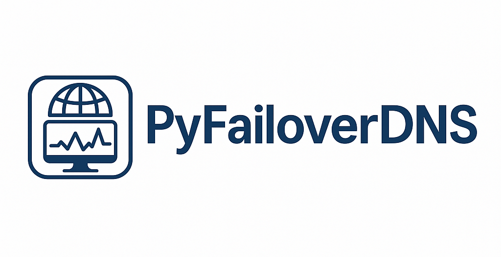

# PyFailoverDNS

PyFailoverDNS is a fault-tolerant DNS system that dynamically returns IP addresses based on the actual availability of target hosts. Its main goal is to ensure uninterrupted access to services with automatic fallback to alternative IPs in case of failures.

## Why it matters:
Traditional DNS records do not reflect the current state of the infrastructure. If the main IP is down, clients will still try to connect to it. PyFailoverDNS solves this by choosing a healthy IP based on real-time checks performed by monitoring agents. This allows you to:

+ Increase service resilience

+ Automatically exclude unreachable nodes from DNS responses

+ Return fallback IPs in case of full outage


# Features:

+ Supports multiple zones and domains

+ Flexible monitoring and fallback settings

+ Policy system for failover logic (any, with future support for quorum, priority, all)

+ REST API for viewing status and assigning tasks

+ Local DNS server for .failover zones

+ Agent task filtering by tags

+ Response caching with configurable TTL

## How it works:

1. Monitoring agents perform regular TCP/HTTP/ICMP checks against target hosts.

2. Each agent sends check results to the master server via REST API (/api/v1/report).

3. The master collects reports and applies a policy (e.g., any, quorum, all) to determine which IPs are healthy.

4. The built-in DNS server replies to client queries based on this information.

5. If no IPs are considered alive — fallback addresses are returned.

## Example master config (config.yaml):
```
dns:
  listen_ip: "0.0.0.0"
  listen_port: 8053
  resolve_cache_ttl: 5

api:
  listen_ip: "0.0.0.0"
  listen_port: 8000

zones:
  - name: "failover"
    fallback_ttl: 30
    domains:
      webmail.failover:
        fallback:
          - "10.10.10.254"
        server:
          policy: any
          timeout_sec: 60
        monitor:
          mode: tcp
          monitor_tag: test
          targets:
            - ip: 10.10.10.250
              port: 443
            - ip: 10.10.10.251
              port: 443
        agent:
          interval_sec: 30
          timeout_sec: 5
          token: "secret_token"
```

## Example agent config (agent_config.yaml):
```
agent_id: example

servers:
  - name: server1
    url: http://server_ip_or_dns:8000
    token: "secret_token"
    tags:
      - test
```


## Usage:
### To start the master server:
`python main.py --config <path_to_config.yaml>`

### To run an agent:
`python agent.py --config <path_to_config.yaml>`

## Dependencies:
+ fastapi
+ uvicorn
+ dnslib
+ pyyaml
+ pydantic
+ dnspython

## Integration with CoreDNS:
If you already use CoreDNS (e.g. in a Kubernetes environment), you can delegate a specific zone like .failover to PyFailoverDNS.

### CoreDNS example (Corefile):
```
. {
  forward . 1.1.1.1 8.8.8.8
  log
  errors
}

failover {
  forward . 127.0.0.1:8053
}
```

### Explanation:
+ All regular DNS zones will be resolved via 1.1.1.1 and 8.8.8.8.

+ Any domain under .failover (like webmail.failover) will be forwarded to PyFailoverDNS.

### To use this setup:
1. Make sure PyFailoverDNS is listening on 0.0.0.0:8053 or localhost:8053.

2. Ensure your config.yaml includes the failover zone and relevant domains.

3. Restart CoreDNS with the updated Corefile.

### Example DNS query:
```
dig @{coredns_ip} -p 8053 webmail.failover
```

CoreDNS will forward the request to PyFailoverDNS, which replies based on current agent checks.

## Integration with dnsmasq
You can use PyFailoverDNS with dnsmasq to forward .failover domain queries to your local PyFailoverDNS instance.

### Example configuration (/etc/dnsmasq.d/failover.conf):
```
server=/failover/127.0.0.1#8053
```

### Explanation:
+ Any DNS queries ending in .failover will be forwarded to PyFailoverDNS running on port 8053.

+ All other domains will be resolved via the default DNS flow.

### After editing the configuration:
`sudo systemctl restart dnsmasq`

### Example query:
`dig webmail.failover @<dnsmasq_ip>`


## Roadmap
+ Support for additional failover policies: quorum, all, priority

+ Docker images for both master and agent

+ New check types: HTTP, ICMP, etc.

+ Prometheus metrics support

